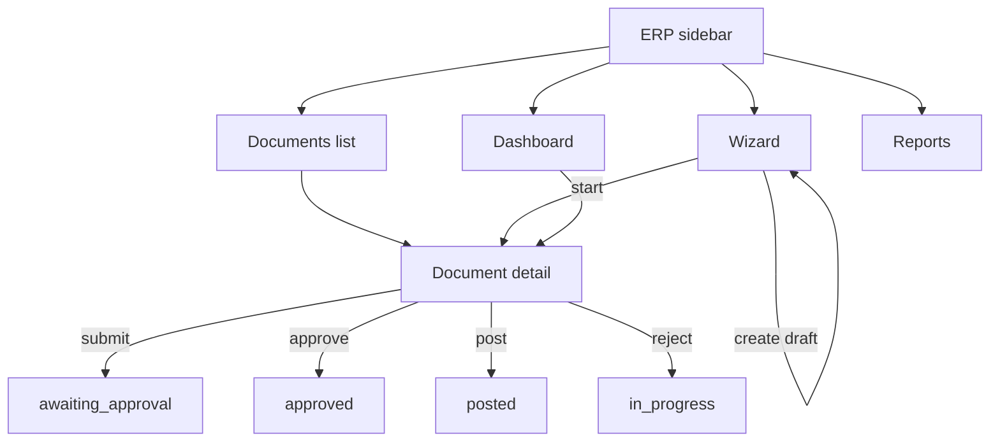

# Inventory Count Module — Frontend Architecture

> **Scope:** `frontend/src/modules/inventoryCount`, `frontend/src/pages/inventory-count`, `frontend/src/pages/wms/inventory-count`, `frontend/src/api/inventoryCount*.ts`  
> **Out of scope:** general stock views (`InventoryList`, analytics inventory value, product traceability).

---

## Layer model (target)

```
pages/                          ← thin route shells (params + hook + view)
modules/inventoryCount/
  ui/erp/                       ← ERP presentation only (dense, analytical)
  ui/wms/                       ← WMS presentation only (scanner-first, touch)
  hooks/                        ← React hooks, scan orchestration
  offline/                      ← sync queue, offline status
  *.ts                          ← labels, filters, paths, execution context (logic)
api/
  inventoryCountApi.ts          ← barrel re-export (stable import path)
  inventoryDocumentsApi.ts
  inventoryApprovalApi.ts
  inventoryConflictsApi.ts
  inventoryReportsApi.ts
  inventoryWmsApi.ts
```

**Rule:** visual changes should land in `ui/erp` or `ui/wms`. Hooks, API, storage, and execution context stay outside UI.

---

## Entry points

| Surface | Navigation | First screen |
|---------|------------|--------------|
| **ERP** | `layout/mainNavConfig.tsx` → `/inventory-count/dashboard` | `InventoryCountDashboardPage` |
| **WMS** | `pages/wms/wmsTabConfig.ts` → `/wms/inventory-count` | `WmsInventoryCountLandingPage` |

---

## Route tree

### ERP (`InventoryCountErpLayout`)

```
/inventory-count                          → redirect dashboard
/inventory-count/dashboard                → InventoryCountDashboardPage
/inventory-count/documents                → InventoryCountDocumentsPage (all statuses incl. draft)
/inventory-count/documents/:documentId    → InventoryCountDocumentDetailPage
/inventory-count/wizard                   → InventoryCountWizardPage (new)
/inventory-count/wizard/:documentId       → InventoryCountWizardPage (resume draft)
/inventory-count/reports                  → InventoryCountReportsPage
```

### WMS (`WmsInventoryCountLayout`)

```
/wms/inventory-count                                    → WmsInventoryCountLandingPage
/wms/inventory-count/d/:documentId                      → WmsInventoryCountEntryPage
/wms/inventory-count/d/:documentId/count/:taskId          → WmsInventoryCountTerminalPage
/wms/inventory-count/count/:taskId                      → WmsInventoryCountTaskRedirect (legacy)
/wms/inventory-count/tasks                              → redirect root
```

Path builders: `modules/inventoryCount/inventoryCountPaths.ts`

---

## ERP flow map



1. **Planning:** wizard creates/updates draft → `createInventoryDocument` / `updateInventoryWizard`
2. **Start:** wizard step 4 → `startInventoryDocument` → status `in_progress`, tasks materialized
3. **Supervision:** detail page tabs — Przebieg / Różnice / Kontrola
4. **Approval:** submit → `awaiting_approval` → approve/reject → post RW/PW (if `result_policy=update_stock`)

Draft documents appear **only** in ERP documents list and wizard — never in WMS active-documents API.

---

## WMS flow map

```mermaid
flowchart TD
  LAND[Landing: active docs] --> |select in_progress| ENTRY[Entry: scan location]
  ENTRY --> |resolve + open session| TERM[Terminal: count]
  TERM --> |finish location| ENTRY
  SWITCH[Header document switcher] --> ENTRY
  LEGACY[/count/:taskId] --> TERM
```

1. **Landing:** `fetchWmsActiveInventoryDocuments` — `in_progress` + `awaiting_approval` only
2. **Entry:** validates document `in_progress`; `resolveWmsInventoryLocationScan(documentId)` → `openWmsInventorySession`
3. **Terminal:** location → optional carrier → product scans → `recordInventoryScan`
4. **Switch:** `WmsInventoryDocumentSwitcher` + `wmsActiveDocumentStorage` (sessionStorage per warehouse)

---

## Data flow

### ERP document detail

```
useInventoryDocumentDetail (hook)
  ├─ fetchInventoryDocument, getDocumentDifferenceAnalysis, fetchInventoryPostingPreview
  ├─ listDocumentLines (focus: operational | differences | all)
  ├─ fetchInventoryConflicts, fetchInventoryUnknownProducts
  └─ fetchInventoryAuditLog, fetchInventoryDocumentTimelines (Kontrola tab)
       ↓
InventoryDocumentDetailView (ui/erp) — props only, no fetch
```

### WMS terminal

```
useWmsInventoryCountTerminal (hook — state machine)
  ├─ fetchWmsInventoryTask, fetchWmsTaskLines, openWmsInventorySession
  ├─ confirmWmsInventoryLocation, resolveWmsInventoryBarcode, resolveWmsInventoryCarrier
  ├─ recordInventoryScan
  └─ wmsInventoryExecutionContext (carrier grouping, barcode prefixes)
       ↓
WmsInventoryTerminalView (ui/wms) — props only
```

---

## State persistence

| Key / file | Storage | Purpose |
|------------|---------|---------|
| `wms-inv-active-doc-{warehouseId}` | sessionStorage | Active inventory document per warehouse |
| `inv-doc-tab-{documentId}` | sessionStorage | ERP detail active tab |
| `inv-table-filters-{documentId}` | sessionStorage | ERP line filter toolbar |
| `wms-inventory-recent-location-sessions` | localStorage | Recent locations on entry screen |
| `wms-inventory-location-session-products` | localStorage | Per-location product aggregates |
| `wms.inventory_count.sync_queue` | localStorage | Offline scan operation queue |
| `warehouse` | localStorage | Shared warehouse selection (`WarehouseContext`) |

No inventory-specific Zustand/Redux store.

---

## Offline sync flow

```
recordInventoryScan fails (offline)
  → inventoryCountSyncQueue.enqueue({ kind: "scan", ... })
  → useInventoryCountOfflineStatus reports pendingOps
  → on reconnect: terminal hook retries / refresh (partial — full sync engine not implemented)
```

Files: `offline/inventoryCountSyncQueue.ts`, `offline/useInventoryCountOfflineStatus.ts`

---

## Approval flow (ERP)

1. Operator finishes counting in WMS
2. Supervisor opens ERP detail → **Wyślij do zatwierdzenia**
3. `InventoryApprovalSummaryModal` loads `fetchInventoryPostingPreview`
4. Confirm → `submitInventoryDocumentForApproval`
5. Approver: **Zatwierdź** / **Odrzuć** → `approveInventoryDocument` / `rejectInventoryDocument`
6. **Księguj RW/PW** → `postInventoryDocumentAdjustments` (skipped when `result_policy ≠ update_stock`)

Gating: `inventorySubmitReadiness.ts` + backend `submit_readiness`.

---

## WMS scan flow

```
1. Location confirm     confirmWmsInventoryLocation / entry resolve
2. Carrier (optional)   resolveWmsInventoryCarrier OR skip
3. Product scan         resolveWmsInventoryBarcode(carrier_id?)
4. Qty commit           recordInventoryScan (delta or absolute)
5. Unknown product      createWmsUnknownProduct (modal)
6. Finish location      navigate back to document entry
```

Scan input: `hooks/useInventoryScanInput.ts`  
Feedback: `components/wms/execution/useScanFeedback.ts`

---

## Carrier hierarchy flow

```
wmsInventoryExecutionContext.ts
  isCarrierBarcode(PAL-, BOX-, BIN-, …)
  groupCountedProductsByCarrier(lines) → [carriers…, root shelf]

UI:
  WmsInventoryActiveContextBar  — LOKALIZACJA → NOŚNIK → PRODUKT
  WmsInventoryLocationCounts    — grouped counted lines under carriers
```

Carrier ID passed to `resolveWmsInventoryBarcode` and `recordInventoryScan`.

---

## API layer (split)

| Module | Endpoints |
|--------|-----------|
| `inventoryDocumentsApi.ts` | dashboard, documents CRUD, wizard, lines, scope preview, differences, start |
| `inventoryApprovalApi.ts` | submit, approve, reject, post, posting-preview |
| `inventoryConflictsApi.ts` | conflicts, unknown products map/reject |
| `inventoryReportsApi.ts` | reports catalog, audit log, timelines, blob downloads |
| `inventoryWmsApi.ts` | active-documents, tasks, location resolve, sessions, scan, barcode, carrier, search |
| `inventoryCountApi.ts` | **barrel** — re-exports all (stable import path) |

---

## UI layer

### ERP (`modules/inventoryCount/ui/erp/`)

Presentation: page shells, badges, tables, filter bars, modals, wizard steps, document detail view.

Theme: `ui/erp/theme.ts` (`ERP_INV`)

### WMS (`modules/inventoryCount/ui/wms/`)

Presentation: scan field, context bar, location counts, qty control, document switcher, landing cards, terminal view.

Theme: `ui/wms/theme.ts` (`WMS_INV`)

**ERP and WMS do not share layout primitives.**

---

## Critical / high-risk files

| File | Risk |
|------|------|
| `api/inventoryCountApi.ts` (barrel) | Every consumer imports here |
| `hooks/useWmsInventoryCountTerminal.ts` | WMS state machine |
| `wmsInventoryExecutionContext.ts` | Carrier hierarchy + scan routing |
| `hooks/useInventoryDocumentDetail.ts` | ERP detail orchestration |
| `pages/.../InventoryCountWizardPage.tsx` | Start flow + scope config |
| `wmsActiveDocumentStorage.ts` | Document switch persistence |
| `inventoryTableFilters.ts` | ERP tab filter persistence |
| `inventoryCountApiErrors.ts` | Start/approval error UX |
| `offline/inventoryCountSyncQueue.ts` | Scan durability |

---

## Orphaned / legacy files

Moved to `frontend/_archive/inventory-count-legacy/`:

| File | Reason |
|------|--------|
| `WmsInventoryCountExecutionPage.tsx` | Not routed; pre document-scoped flow |
| `useWmsInventoryCountExecution.ts` | Only used by execution page |
| `WmsInventoryTaskQueue.tsx` | Unwired queue UI |
| `WmsInventoryTaskRow.tsx` | Queue row |
| `WmsInventoryMinimalQueue.tsx` | Queue variant |
| `WmsInventoryTaskFiltersBar.tsx` | Queue filters |
| `WmsInventorySessionSummary.tsx` | Unwired summary panel |
| `WmsInventoryEmergencySearch.tsx` | Unwired search overlay |
| `WmsInventoryOperationalSearchModal.tsx` | Unwired modal search |
| `WmsInventoryUniversalSearchModal.tsx` | Legacy execution modal |
| `WmsInventoryProductChipList.tsx` | Legacy execution chips |

### Legacy execution flow (removed from active paths)

```
OLD: /wms/inventory-count → auto queue → /count/:taskId → WmsInventoryCountExecutionPage
NEW: /wms/inventory-count → landing → /d/:documentId → /d/:documentId/count/:taskId → Terminal
```

---

## Recommended future cleanup

1. Split `useWmsInventoryCountTerminal.ts` into: session loader, carrier handler, scan commit handler
2. Move `useWmsInventoryLiveSearch` out of live search dropdown into `hooks/`
3. Scope `recentLocationsStorage` by `documentId`
4. Extract `useInventoryWizard` from wizard page
5. Add `ui/wms/LandingDocumentList.tsx` for landing card presentation
6. Delete shim re-exports under `erp/components/` and `components/` once imports migrated
7. Backend mirror: keep resolver SSOT; frontend stays projection-only

---

## File inventory (active)

See module tree:

```
modules/inventoryCount/
  ui/erp/          ← ERP presentation
  ui/wms/          ← WMS presentation
  hooks/
  offline/
  erp/downloadHelpers.ts   ← blob download utils (not UI)
  inventoryCountPaths.ts
  inventoryCountUiLabels.ts
  inventoryStrategyConfig.ts
  inventoryTableFilters.ts
  wmsInventoryExecutionContext.ts
  wmsActiveDocumentStorage.ts
  recentLocationsStorage.ts
  …

pages/inventory-count/     ← ERP route shells
pages/wms/inventory-count/ ← WMS route shells
```
